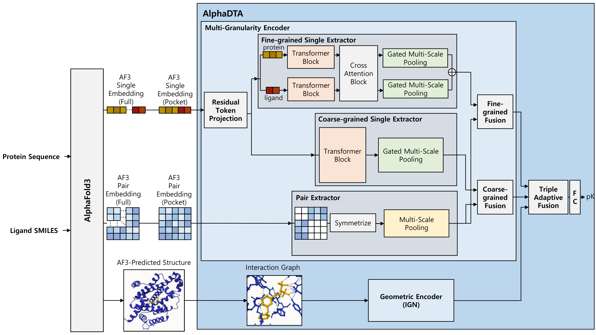

# AlphaDTA



AlphaDTA is a deep learning framework for protein-ligand binding affinity prediction that leverages AlphaFold3 embeddings and 3D complex structure information.

## Environment Setup

### 1. Create Conda Environment

```bash
conda env create -f env.yml
```

### 2. Install DGL

Download the DGL wheel file from [data.dgl.ai/wheels/repo.html](https://data.dgl.ai/wheels/repo.html):

```bash
# Download dgl-1.0.2+cu113-cp37-cp37m-manylinux1_x86_64.whl
pip install dgl-1.0.2+cu113-cp37-cp37m-manylinux1_x86_64.whl
```

### 3. Install PyTorch and Additional Dependencies

```bash
# Install PyTorch with CUDA support
conda install pytorch==1.13.1 torchvision==0.14.1 torchaudio==0.13.1 pytorch-cuda=11.6 -c pytorch -c nvidia

# Install OpenBabel
conda install -c conda-forge openbabel=2.4.1

# Install other dependencies
pip install seaborn
conda install -c conda-forge biopython
conda install -c conda-forge pymol-open-source
```

### 4. Install Chimera

Install [UCSF Chimera (v1.17.3)](https://www.cgl.ucsf.edu/chimera/download.html) for structure visualization and processing.

## Quick Start

### Download Data

Run the data download script to fetch the preprocessed dataset:

```bash
python utils/download_data.py
```

This will create a `data` folder in the repository. The dataset is hosted on [Hugging Face](https://huggingface.co/datasets/minjae-chung/alphadta).

Pre-trained model checkpoints are stored in `checkpoints/alphadta` as `.pth` files.

## Evaluation

### LP-PDBbind

```bash
python protocols/lp_pdbbind/evaluate.py --model_path {model_path}
```

### CleanSplit (CASF-2016)

```bash
python protocols/cleansplit/evaluate_casf2016.py \
    --csv_path data/csv/cleansplit/casf2016.csv \
    --graph_dir data/interaction_graph/test/crystal/casf2016_graph_ls \
    --embedding_dir data/af3_embedding/casf2016 \
    --model_dir checkpoints/alphadta/cleansplit
```

## Training

### LP-PDBbind

```bash
python protocols/lp_pdbbind/train.py \
    --config configs/alphadta.yaml \
    --lr 5e-4 \
    --seed 2 \
    --batch_size 32
```

Training results will be saved to `output/lp_pdbbind`.

### CleanSplit

```bash
python protocols/cleansplit/train.py \
    --config configs/alphadta.yaml \
    --csv_path data/csv/cleansplit/train-validation.csv \
    --split_dir protocols/cleansplit/cv_split \
    --graph_dir data/interaction_graph/train-valid/cleansplit_graph_ls \
    --embedding_dir data/af3_embedding/pdbcleansplit_only data/af3_embedding/shared \
    --lr 1e-4 \
    --batch_size 64 \
    --seed 2
```

Training results will be saved to `output/cleansplit`.

## Data Preprocessing for New Complexes

To run AlphaDTA on new protein-ligand complexes, follow these preprocessing steps:

### 1. Run AlphaFold3

First, generate AlphaFold3 predictions for your protein-ligand complexes. Refer to the [AlphaFold3 repository](https://github.com/google-deepmind/alphafold3) and the Supplementary Materials of the AlphaDTA paper for detailed setup instructions.

> **Important (AlphaFold3 input JSON order)**  
> When creating AlphaFold3 input JSON files, make sure the `sequences` list is ordered as:  
> **(1) protein sequence → (2) ligand smiles**  

**Example**
```json
{
  "name": "abemaciclib",
  "modelSeeds": [42],
  "sequences": [
    {
      "protein": {
        "id": "A",
        "sequence": "MQRSPLEKASVVSKLFFSWTR...",
        "templates": []
      }
    },
    {
      "ligand": {
        "id": "L",
        "smiles": "CCN1CCN(CC1)CC2=CN=C(NC3=NC=C(F)C(=N3)C4=CC(=C5N=C(C)[N](C(C)C)C5=C4)F)C=C2"
      }
    }
  ],
  "dialect": "alphafold3",
  "version": 2
}
```

### 2. Prepare Input Structure

Organize your AlphaFold3 input JSON files and output folders. For example:

**Input JSON files:**
- `CFTR/af_input/abemaciclib.json`
- `CFTR/af_input/acebutolol_hcl.json`

**AlphaFold3 outputs (embeddings and CIF file):**
- `CFTR/af_output/abemaciclib/`
- `CFTR/af_output/acebutolol_hcl/`

### 3. Preprocess Embeddings

```bash
python preprocess/preprocess_pt.py --dataset_root "CFTR"
```

This generates the `processed_emb` directory and a CSV file.

### 4. Preprocess Structures

```bash
python preprocess/preprocess_structure.py \
    --dataset_dir CFTR \
    --label_csv /path/to/labels.csv \
    --num_process 12 \
    --verbose
```

This generates:
- `processed_structure/graph_ls` containing interaction graphs

You can now use the preprocessed embeddings and graphs as input to AlphaDTA.

## Citation

If you use AlphaDTA in your research, please cite:

```bibtex
@article{abramson2024accurate,
  title={Accurate structure prediction of biomolecular interactions with AlphaFold 3},
  author={Abramson, Josh and Adler, Jonas and Dunger, Jack and Evans, Richard and Green, Tim and Pritzel, Alexander and Ronneberger, Olaf and Willmore, Lindsay and Ballard, Andrew J and Bambrick, Joshua and others},
  journal={Nature},
  volume={630},
  number={8016},
  pages={493--500},
  year={2024},
  publisher={Nature Publishing Group UK London}
}

@article{wang2004pdbbind,
  title={The PDBbind database: Collection of binding affinities for protein-ligand complexes with known three-dimensional structures},
  author={Wang, Renxiao and Fang, Xueliang and Lu, Yipin and Wang, Shaomeng},
  journal={Journal of medicinal chemistry},
  volume={47},
  number={12},
  pages={2977--2980},
  year={2004},
  publisher={ACS Publications}
}

@article{li2024leak,
  title={Leak proof PDBBind: A reorganized dataset of protein-ligand complexes for more generalizable binding affinity prediction},
  author={Li, Jie and Guan, Xingyi and Zhang, Oufan and Sun, Kunyang and Wang, Yingze and Bagni, Dorian and Head-Gordon, Teresa},
  journal={ArXiv},
  pages={arXiv--2308},
  year={2024}
}

@article{graber2025resolving,
  title={Resolving data bias improves generalization in binding affinity prediction},
  author={Graber, David and Stockinger, Peter and Meyer, Fabian and Mishra, Siddhartha and Horn, Claus and Buller, Rebecca},
  journal={Nature Machine Intelligence},
  pages={1--13},
  year={2025},
  publisher={Nature Publishing Group UK London}
}
```
